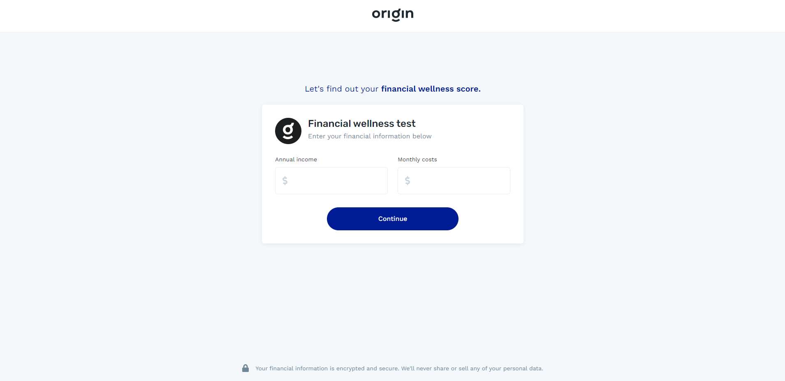
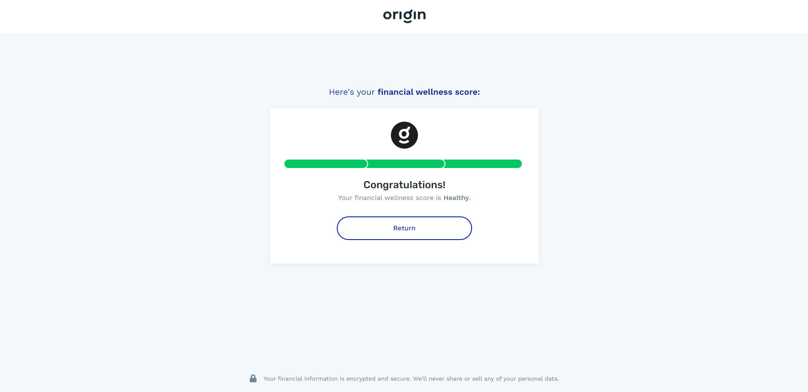

# Origin Assignment - Frontend

<details>
  <summary>Table of Contents</summary>
  <ol>
    <li>
      <a href="#about-the-project">About The Project</a>
    </li>
    <li><a href="#built-with">Built With</a></li>
    <li>
      <a href="#getting-started">Getting Started</a>
      <ul>
        <li><a href="#dependencies">Dependencies</a></li>
        <li><a href="#configuration">Configuration</a></li>
        <li><a href="#execution">Execution</a></li>
      </ul>
    </li>
  </ol>
</details>

## About The Project

This project is the frontend application ([click here](https://github.com/laryssacarvalho/OriginAssignment) to access the backend repository) of this [Origin's assignment](https://github.com/OriginFinancial/full-stack-take-home-assignment). 

The application consists of only one feature: calculate the financial score of a user based on their personal data, so the user inputs the annual income and monthly costs and the resulting score will appear on the screen (the score can be Healthy, Medium or Low).




## Built With

Here are the main frameworks/libraries used on this project.

* [Angular](https://angular.io/)
* [Bootstrap](https://getbootstrap.com)
* [Font Awesome](https://fontawesome.com/)
* [Ng2 Currency Mask](https://www.npmjs.com/package/ng2-currency-mask)

I chose Angular because it's the frontend framework I have the most experience with.

## Getting Started
There are two ways of running this project: on your machine or on a docker container. The latter one is easier if you have Docker installed. 

### Dependencies

Wheter you are using Docker or not, you will need to install the application backend (check the documentation to see how to execute it):

* [API project](https://github.com/laryssacarvalho/OriginAssignment)

If you are going to execute the project on your machine, then you will need to install these dependencies too:

* [Node.js](https://nodejs.org/en/)
* [Angular CLI](https://github.com/angular/angular-cli)

### Configuration
The only configuration is the URL of the backend API, this can be done in the _/environments/environment.ts_ or _/environments/environment.prod.ts_ (if you are running on the container). You don't need to change the default value unless you execute the API on another port.

### Execution

#### On your machine

After cloning this repository you will need to execute the following commands on the root folder:

```
npm install
```
This will install all the project dependencies

```
ng serve
```
This will execute the project, just access http://localhost:4200 to view the application.

#### Using Docker

If you have Docker installed, then you only need to execute this two commands. The first one is going to build the image using the Dockerfile on the root of the project and the second one will run a container using that image.

```
docker build -t origin-angular-image .
```

```
docker run -it --rm -p 9000:80 origin-angular-image
```

You can now access http://localhost:9000 to view the application.
